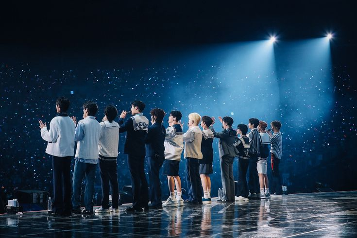
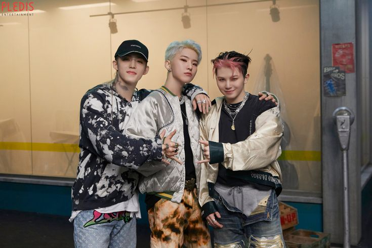
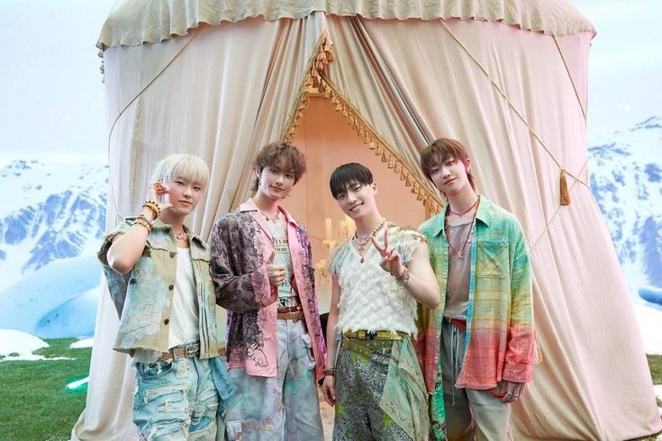
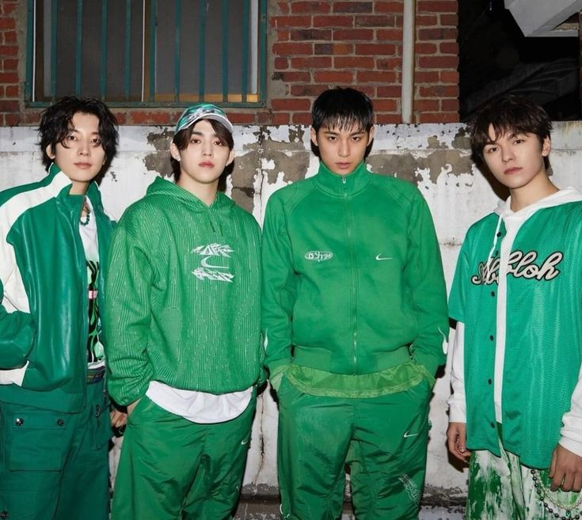
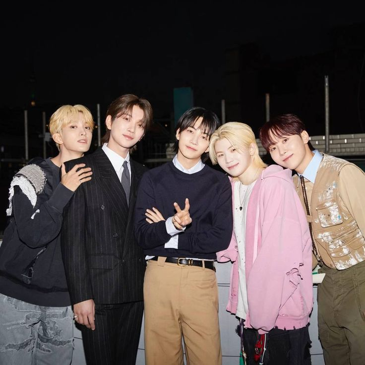
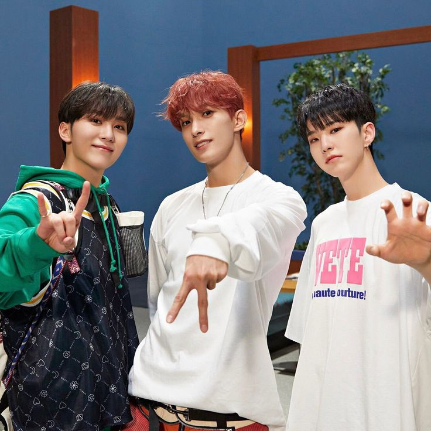

### Introduction to know about Seventeen

- **Seventeen is a South Korean boy band formed by Pledis Entertainment. The group consists of thirteen members: `S.Coups`, `Jeonghan`, `Joshua`, `Jun`, `Hoshi`, `Wonwoo`, `Woozi`, `DK`, `Mingyu`, `The8`, `Seungkwan`, `Vernon`, and `Dino`.**

- Here to know more about [Seventeen](https://en.wikipedia.org/wiki/Seventeen_(South_Korean_band)).

---

### Seventeen's Music!!

The following are some of the music videos of Seventeen:

#### KOREAN MVS:

- [God of Music](https://youtu.be/zSQ48zyWZrY)
- [Maestro](https://www.youtube.com/watch?v=ThI0pBAbFnk&list=PLk_UmMfvZDx2wu3ynTngcZMzgH4l2SgLP&index=12&pp=iAQB8AUB)
- [LOVE, FAME, MONEY](https://www.youtube.com/watch?v=5NPe8_gDSr4&list=PLk_UmMfvZDx2wu3ynTngcZMzgH4l2SgLP&index=5&pp=iAQB8AUB)
- [Super](https://www.youtube.com/watch?v=-GQg25oP0S4&list=PLk_UmMfvZDx2wu3ynTngcZMzgH4l2SgLP&index=18&pp=iAQB8AUB)
- [_WORLD](https://www.youtube.com/watch?v=VCDWg0ljbFQ&list=PLk_UmMfvZDx2wu3ynTngcZMzgH4l2SgLP&index=26&pp=iAQB8AUB)
- [HOT](https://www.youtube.com/watch?v=gRnuFC4Ualw&list=PLk_UmMfvZDx2wu3ynTngcZMzgH4l2SgLP&index=28&pp=iAQB8AUB)
- [Darl+ing](https://www.youtube.com/watch?v=bTtNV6hgDno&list=PLk_UmMfvZDx2wu3ynTngcZMzgH4l2SgLP&index=29&pp=iAQB8AUB)
- [Rock with you](https://www.youtube.com/watch?v=WpuatuzSDK4&list=PLk_UmMfvZDx2wu3ynTngcZMzgH4l2SgLP&index=33&pp=iAQB8AUB)
- [Ready to Love](https://www.youtube.com/watch?v=yCvSR4lSqTg&list=PLk_UmMfvZDx2wu3ynTngcZMzgH4l2SgLP&index=34&pp=iAQB8AUB)
- [HOME;RUN](https://www.youtube.com/watch?v=UB4FzllQCyc&list=PLk_UmMfvZDx2wu3ynTngcZMzgH4l2SgLP&index=40&pp=iAQB8AUB)
- [Left & Right](https://www.youtube.com/watch?v=HdZdxocqzq4&list=PLk_UmMfvZDx2wu3ynTngcZMzgH4l2SgLP&index=42&pp=iAQB8AUB)
- [My My](https://www.youtube.com/watch?v=PQOJJ037ys8&list=PLk_UmMfvZDx2wu3ynTngcZMzgH4l2SgLP&index=43&pp=iAQB8AUB)
- [Hit](https://www.youtube.com/watch?v=F9CrRG6j2SM&list=PLk_UmMfvZDx2wu3ynTngcZMzgH4l2SgLP&index=47&pp=iAQB8AUB)
- [Home](https://www.youtube.com/watch?v=R9VDPMk5ls0&list=PLk_UmMfvZDx2wu3ynTngcZMzgH4l2SgLP&index=50&pp=iAQB8AUB)

---

### Seventeen 

---

## SUB-UNIT

### Seventeen is a South Korean boy group formed by Pledis Entertainment. The group is divided into three sub-units, each specializing in different areas of performance:`Leader` `Hip-Hop Team`, `Vocal Team`, and `Performance Team`. 

#### Here's a brief description of each:

---

## THE LEADERS

The Leader Unit is a special sub-unit of Seventeen composed of the leaders of the three main sub-units. This unit showcases their leadership and creative synergy across different aspects of the group's music and performances.

### Leader Unit Members: ``S.Coups` (Leader of Seventeen and Hip-Hop Team), `Woozi` (Leader of the Vocal Team), `Hoshi` (Leader of the Performance Team)

Focus:

The Leader Unit represents Seventeen's teamwork and collaborative spirit.

They highlight the unity and cohesion between the sub-units while bringing their distinct strengths—rap, vocals, and performance—into a seamless blend.

---

#### SEVENTEEN's Leaders Unit, known as SVT LEADERS, has released the following songs:

### 1. ["Change Up"](https://open.spotify.com/track/6j6wUN8whCYTwxCg9R240U?si=651a970aa1c04344)

Release Date: September 2017

### 2. ["Cheers"](https://open.spotify.com/track/1pdFdv8R6ezIAUUNkn785b?si=0f7e0785d72e40e1)

Release Date: July 2022

#### These tracks highlight the collaborative efforts of SEVENTEEN's unit leaders.

---

## PERFORMANCE TEAM

### Members: `Hoshi (leader)`, `Jun`, `The8`, `Dino`

Focus: Dance and choreography

Description: The performance team focuses on creating dynamic and captivating choreography. They are recognized for their sharp and synchronized moves that elevate Seventeen's live performances to a whole new level.

---

#### Here is a comprehensive list of songs by SEVENTEEN's Performance Team, comprising members Hoshi, Jun, The8, and Dino:

### 1. "Jam Jam"

Album: 17 Carat (2015)

### 2. "OMG"

Album: Boys Be (2015)

### 3. "Shining Diamond" (Performance Team Version)

Album: Love & Letter (2016)

### 4. "Highlight"

Album: Going Seventeen (2016)

### 5. "Swimming Fool"

Album: Al1 (2017)

### 6. "Lilili Yabbay" (13월의 춤)

Album: Teen, Age (2017)

### 7. "Moonwalker"

Album: Director's Cut (2018)

### 8. "247"

Album: You Make My Day (2018)

### 9. "Flower"

Album: You Made My Dawn (2019)

### 10. "Light a Flame"

Album: Semicolon (2020)

### 11. "Wave"

Album: Your Choice (2021)

### 12. "PANG!"

Album: Attacca (2021)

### 13. "Back it up"

Album: An Ode (2019)

### 14. "Fire"

Album: FML (2023)

### 15. "Spell"

Album: 17 Is Right Here (2024)

#### These tracks showcase the Performance Team's dynamic choreography and their significant contributions to SEVENTEEN's diverse discography.

To listen to these songs, click [here](https://open.spotify.com/playlist/6Z3pDjQFwvkIqQYuehuh7P?si=Xn-3dV8USMeswo2UMUdvzQ).

---

## HIP-HOP TEAM

### Members: `S.Coups (leader)`, `Wonwoo`, `Mingyu`, `Vernon`

Focus: Rapping and lyricism

Description: This team is responsible for the group's rap performances and often contributes to writing their own rap verses. Their music tends to have a strong, charismatic vibe, showcasing their versatility in different rap styles.

---

#### Here is a comprehensive list of songs SEVENTEEN's Hip-Hop Team, which includes members S.Coups, Wonwoo, Mingyu, and Vernon:

### 1. "Ah Yeah"

Album: 17 Carat (2015)

### 2. "Fronting" (표정관리)

Album: Boys Be (2015)

### 3. "Mansae" (만세) - Hip-Hop Team Version

Album: Love & Letter (2016)

### 4. "Lean On Me" (기대)

Album: Going Seventeen (2016)

### 5. "If I"

Album: Al1 (2017)

### 6. "Trauma"

Album: Teen, Age (2017)

### 7. "Un Haeng Il Chi" (언행일치)

Album: Director's Cut (2018)

### 8. "What's Good"

Album: You Make My Day (2018)

### 9. "Chilli" (칠리)

Album: You Made My Dawn (2019)

### 10. "Back It Up"

Album: An Ode (2019)

### 11. "GAM3 BO1"

Album: Your Choice (2021)

### 12. "I Can't Run Away" (그리워하는것까지)

Album: Attacca (2021)

### 13. "Fire"

Album: FML (2023)

### 14. "Monster"

Album: Seventeenth Heaven (2023)

### 15. "Lalali"

Album: 17 Is Right Here (2024)

#### These tracks highlight the Hip-Hop Team's evolution and contributions to SEVENTEEN's diverse discography.

To listen to these songs, click [here](https://open.spotify.com/playlist/0KJhFPa023nJRL03KsxsXv?si=mcu8YCRWS0uNHtmunzDKhA)

---

## VOCAL TEAM

### Members: `Woozi (leader)`, `Jeonghan`, `Joshua`, `DK`, `Seungkwan`

Focus: Vocals and harmonization

Description: Known for their melodious voices and emotional performances, the vocal team delivers the group's most heartfelt and vocally intricate tracks. They specialize in creating beautiful harmonies and touching ballads.

---

#### Here is a comprehensive list of songs by SEVENTEEN's Vocal Team, comprising members Woozi, Jeonghan, Joshua, DK, and Seungkwan:

### 1. "20"

Album: 17 Carat (2015)

### 2. "When I Grow Up"

Album: Boys Be (2015)

### 3. "Say Yes"

Album: Love & Letter (2016)

### 4. "Adore U" (Vocal Team Version)

Album: Love & Letter (2016)

### 5. "Simple"

Album: Love & Letter Repackage Album (2016)

### 6. "Don't Listen in Secret"

Album: Going Seventeen (2016)

### 7. "Habit"

Album: Al1 (2017)

### 8. "Pinwheel"

Album: Teen, Age (2017)

### 9. "Falling for U"

Album: Director's Cut (2018)

### 10. "Come to Me"

Album: You Make My Day (2018)

### 11. "Hug"

Album: You Made My Dawn (2019)

### 12. "Second Life"

Album: An Ode (2019)

### 13. "Same Dream, Same Mind, Same Night"

Album: Your Choice (2021)

### 14. "Imperfect Love"

Album: Attacca (2021)

### 15. "Darl+ing" (Vocal Team Version)

Album: Face the Sun (2022)

### 16. "Dust"

Album: Sector 17 (2022)

### 17. "April Shower"

Album: FML (2023)

### 18. "Stars Align"

Album: Seventeenth Heaven (2023)

### 19. "Eternal Sunshine"

Album: 17 Is Right Here (2024)

#### These tracks showcase the Vocal Team's evolution and their significant contributions to SEVENTEEN's diverse discography.

To listen to these songs, click [here](https://open.spotify.com/playlist/0Ftp1CWL7gdppIOLEV7jOf?si=asrX3sEbRBanZ2ldk5XnPw)

---

## BOO-SEOK-SOON (BSS)

### BSS (BooSeokSoon) is a sub-unit of SEVENTEEN consisting of three members: `DK`, `Hoshi`, and `Seungkwan`.

The unit's name, BooSeokSoon, comes from the first syllables of each member's name (Boo from Seungkwan, Seok from DK, and Soon from Hoshi).

---

#### SEVENTEEN's sub-unit BSS (BooSeokSoon), comprising members DK, Hoshi, and Seungkwan, has released the following songs:

### 1. "Just Do It"

Release Date: March 21, 2018   
Album: Single

### 2. "Second Wind"

Release Date: February 6, 2023   
Album: Second Wind   
"Fighting"   
"Lunch"   
"7PM" (feat. Peder Elias)   

### 3. "CBZ (Prime Time)"

Release Date: January 8, 2025   
Album: Teleparty   
"Happy Alone"   
"Love Song"   

---

#### Each unit plays a crucial role in shaping Seventeen's identity as a versatile and self-producing idol group. Together, they balance their strengths to deliver unique and high-quality music and performances.

To listen to these songs, click [here](https://open.spotify.com/playlist/1ojJX2B49LpI7CY5JY4ihk?si=eltXEPr7Rma272X6CYt21w)

---

